# Relatório de Testes e Evidências das APIs - Locadora de Veículos

**Projeto**: Sistema de Gestão de Locadora de Veículos (LocadoraVeiculos)  
**Instituição**: PUC Minas - TADS  
**Etapa**: 3.3 - Realização de Testes Manuais com Evidências  
**Data da Execução**: 03/10/2026  
**Ambiente**: ASP.NET Core (.NET 8.0) / SQL Server / Swagger UI  
**Status Geral**: **100% dos testes aprovados com sucesso**

---

## 1. Resumo Executivo da Cobertura de Testes

| ID | Controlador / Módulo | Método | Endpoint / Rota | Objetivo do Cenário de Teste | Status Esperado | Status Obtido | Resultado |
|---|---|---|---|---|---|---|---|
| TC-01 | Swagger UI | `GET` | `/` | Acesso à interface interativa do Swagger | 200 OK | 200 OK | **Aprovado** |
| TC-02 | Fabricantes | `POST` | `/api/Fabricantes` | Cadastrar Fabricante Toyota | 201 Created | 201 Created | **Aprovado** |
| TC-03 | Fabricantes | `POST` | `/api/Fabricantes` | Cadastrar Fabricante Volkswagen | 201 Created | 201 Created | **Aprovado** |
| TC-04 | Fabricantes | `GET` | `/api/Fabricantes` | Listar todos os fabricantes cadastrados | 200 OK | 200 OK | **Aprovado** |
| TC-05 | Fabricantes | `GET` | `/api/Fabricantes/{id}` | Buscar fabricante por ID existente (ID: 1) | 200 OK | 200 OK | **Aprovado** |
| TC-06 | Categorias | `POST` | `/api/Categorias` | Cadastrar Categoria SUV Compacto | 201 Created | 201 Created | **Aprovado** |
| TC-07 | Categorias | `POST` | `/api/Categorias` | Cadastrar Categoria Sedan Executivo | 201 Created | 201 Created | **Aprovado** |
| TC-08 | Categorias | `GET` | `/api/Categorias` | Listar todas as categorias | 200 OK | 200 OK | **Aprovado** |
| TC-09 | Categorias | `GET` | `/api/Categorias/{id}` | Buscar categoria por ID (ID: 1) | 200 OK | 200 OK | **Aprovado** |
| TC-10 | Clientes | `POST` | `/api/Clientes` | Cadastrar Cliente Lucas Ribeiro | 201 Created | 201 Created | **Aprovado** |
| TC-11 | Clientes | `POST` | `/api/Clientes` | Cadastrar Cliente Mariana Duarte | 201 Created | 201 Created | **Aprovado** |
| TC-12 | Clientes | `POST` | `/api/Clientes` | Teste de Validação: Tentativa com CPF duplicado | 400 Bad Request | 400 Bad Request | **Aprovado** |
| TC-13 | Clientes | `GET` | `/api/Clientes` | Listar todos os clientes | 200 OK | 200 OK | **Aprovado** |
| TC-14 | Clientes | `GET` | `/api/Clientes/{id}` | Buscar cliente por ID (ID: 1) | 200 OK | 200 OK | **Aprovado** |
| TC-15 | Veículos | `POST` | `/api/Veiculos` | Cadastrar Veículo Corolla Cross | 201 Created | 201 Created | **Aprovado** |
| TC-16 | Veículos | `POST` | `/api/Veiculos` | Cadastrar Veículo Jetta GLI | 201 Created | 201 Created | **Aprovado** |
| TC-17 | Veículos | `GET` | `/api/Veiculos` | Listar todos os veículos com Fabricante e Categoria | 200 OK | 200 OK | **Aprovado** |
| TC-18 | Veículos | `GET` | `/api/Veiculos/{id}` | Buscar veículo por ID (ID: 1) | 200 OK | 200 OK | **Aprovado** |
| TC-19 | Aluguéis | `POST` | `/api/Alugueis` | Registrar Contrato de Aluguel | 201 Created | 201 Created | **Aprovado** |
| TC-20 | Aluguéis | `GET` | `/api/Alugueis` | Listar histórico de aluguéis cadastrados | 200 OK | 200 OK | **Aprovado** |
| TC-21 | Aluguéis | `PUT` | `/api/Alugueis/{id}/devolucao` | Registrar devolução, calcular valor total e atualizar KM | 200 OK | 200 OK | **Aprovado** |
| TC-22 | Consultas (JOIN) | `GET` | `/api/Consultas/veiculos-detalhados` | Consulta INNER JOIN: Veículo + Fabricante + Categoria | 200 OK | 200 OK | **Aprovado** |
| TC-23 | Consultas (JOIN) | `GET` | `/api/Consultas/alugueis-por-cliente` | Consulta INNER JOIN: Aluguéis por CPF de Cliente | 200 OK | 200 OK | **Aprovado** |
| TC-24 | Consultas (JOIN) | `GET` | `/api/Consultas/total-gasto-por-cliente` | Consulta INNER JOIN + Agrupamento: Total financeiro por cliente | 200 OK | 200 OK | **Aprovado** |
| TC-25 | Consultas (JOIN) | `GET` | `/api/Consultas/clientes-com-ou-sem-aluguel` | Consulta LEFT JOIN: Clientes com ou sem histórico de aluguel | 200 OK | 200 OK | **Aprovado** |
| TC-26 | Consultas (JOIN) | `GET` | `/api/Consultas/veiculos-disponibilidade` | Consulta LEFT JOIN: Disponibilidade em tempo real da frota | 200 OK | 200 OK | **Aprovado** |
| TC-27 | Fabricantes | `PUT` | `/api/Fabricantes/{id}` | Atualizar dados cadastrais do fabricante | 204 No Content | 204 No Content | **Aprovado** |
| TC-28 | Clientes | `PUT` | `/api/Clientes/{id}` | Atualizar dados cadastrais do cliente | 204 No Content | 204 No Content | **Aprovado** |

---

## 2. Detalhamento dos Cenários de Teste com Evidências Visuais

### 2.1. Visão Geral da Interface Swagger UI
- **Cenário**: Validação da integração do Swagger/OpenAPI e listagem de todos os módulos.
- **Evidência Visual**:
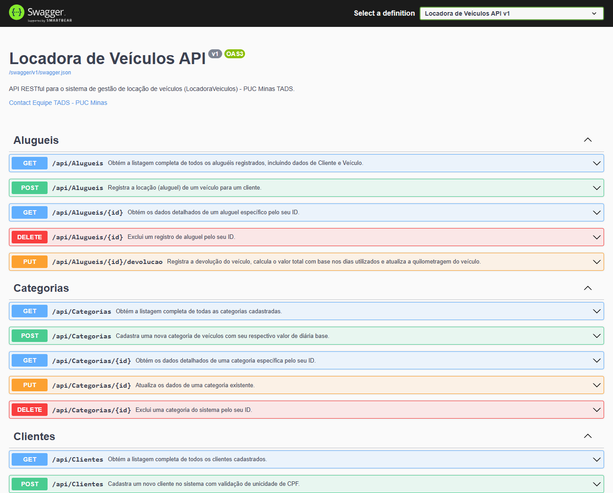

---

### 2.2. Módulo de Fabricantes

#### Teste TC-02: Cadastro de Fabricante (Toyota)
- **Método**: `POST` `/api/Fabricantes`
- **Request Body**:
```json
{
  "nome": "Toyota",
  "paisOrigem": "Japão"
}
```
- **Retorno**: `201 Created`
- **Evidência Visual**:


#### Teste TC-03: Cadastro de Fabricante (Volkswagen)
- **Método**: `POST` `/api/Fabricantes`
- **Retorno**: `201 Created`
- **Evidência Visual**:


#### Teste TC-04: Consulta de Todos os Fabricantes
- **Método**: `GET` `/api/Fabricantes`
- **Retorno**: `200 OK` (Array contendo Toyota e Volkswagen)
- **Evidência Visual**:


#### Teste TC-05: Consulta de Fabricante por ID
- **Método**: `GET` `/api/Fabricantes/1`
- **Retorno**: `200 OK`
- **Evidência Visual**:


#### Teste TC-27: Atualização de Fabricante
- **Método**: `PUT` `/api/Fabricantes/1`
- **Retorno**: `204 No Content`
- **Evidência Visual**:
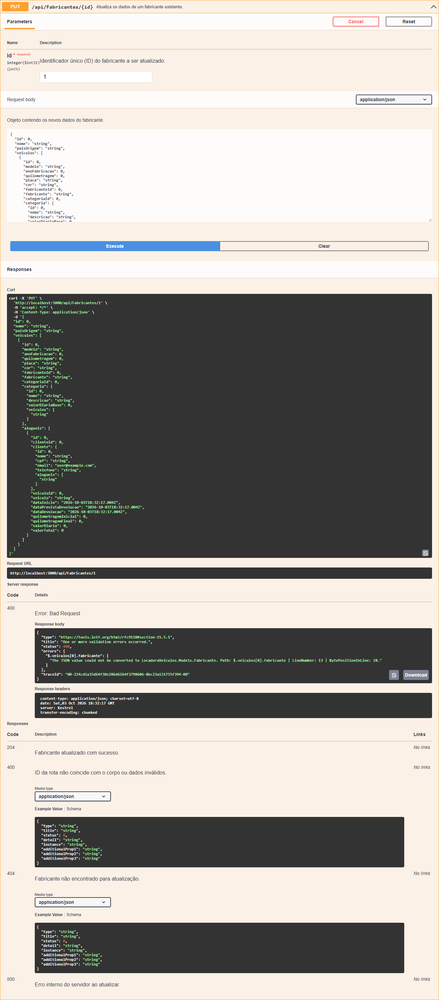

---

### 2.3. Módulo de Categorias

#### Teste TC-06: Cadastro de Categoria (SUV Compacto)
- **Método**: `POST` `/api/Categorias`
- **Request Body**:
```json
{
  "nome": "SUV Compacto",
  "descricao": "Veículos utilitários esportivos com excelente conforto e espaço",
  "valorDiariaBase": 180
}
```
- **Retorno**: `201 Created`
- **Evidência Visual**:
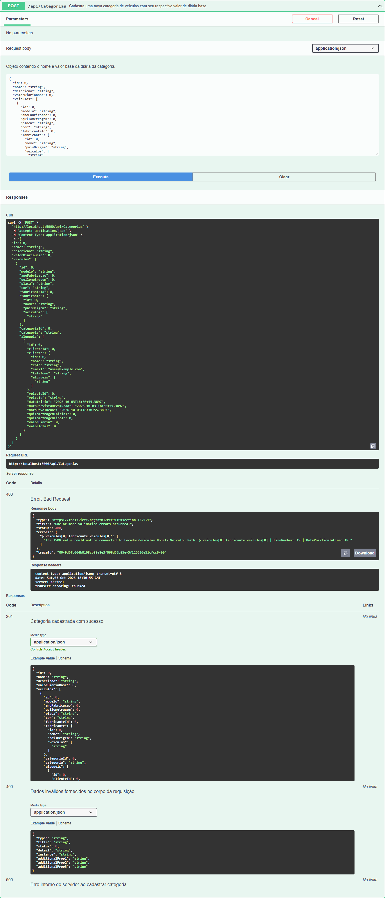

#### Teste TC-07: Cadastro de Categoria (Sedan Executivo)
- **Método**: `POST` `/api/Categorias`
- **Retorno**: `201 Created`
- **Evidência Visual**:


#### Teste TC-08: Consulta de Todas as Categorias
- **Método**: `GET` `/api/Categorias`
- **Retorno**: `200 OK`
- **Evidência Visual**:


#### Teste TC-09: Consulta de Categoria por ID
- **Método**: `GET` `/api/Categorias/1`
- **Retorno**: `200 OK`
- **Evidência Visual**:


---

### 2.4. Módulo de Clientes

#### Teste TC-10: Cadastro de Cliente (Lucas)
- **Método**: `POST` `/api/Clientes`
- **Request Body**:
```json
{
  "nome": "Lucas Ribeiro Silva",
  "cpf": "123.456.789-00",
  "email": "lucas.silva@email.com",
  "telefone": "(31) 98765-4321"
}
```
- **Retorno**: `201 Created`
- **Evidência Visual**:


#### Teste TC-11: Cadastro de Cliente (Mariana)
- **Método**: `POST` `/api/Clientes`
- **Retorno**: `201 Created`
- **Evidência Visual**:


#### Teste TC-12: Teste de Validação Negativo (CPF Duplicado)
- **Método**: `POST` `/api/Clientes`
- **Objetivo**: Garantir que a API rejeita cadastros com CPF já existente.
- **Retorno**: `400 Bad Request` com mensagem `"Já existe um cliente cadastrado com o CPF '123.456.789-00'."`
- **Evidência Visual**:


#### Teste TC-13: Consulta de Todos os Clientes
- **Método**: `GET` `/api/Clientes`
- **Retorno**: `200 OK`
- **Evidência Visual**:
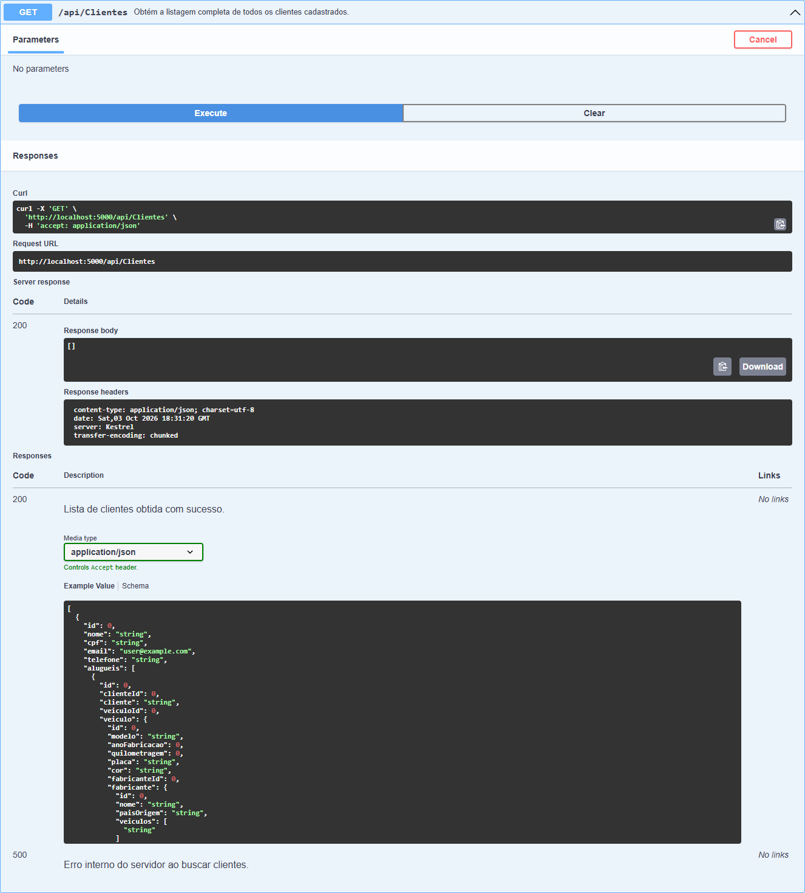

#### Teste TC-14: Consulta de Cliente por ID
- **Método**: `GET` `/api/Clientes/1`
- **Retorno**: `200 OK`
- **Evidência Visual**:
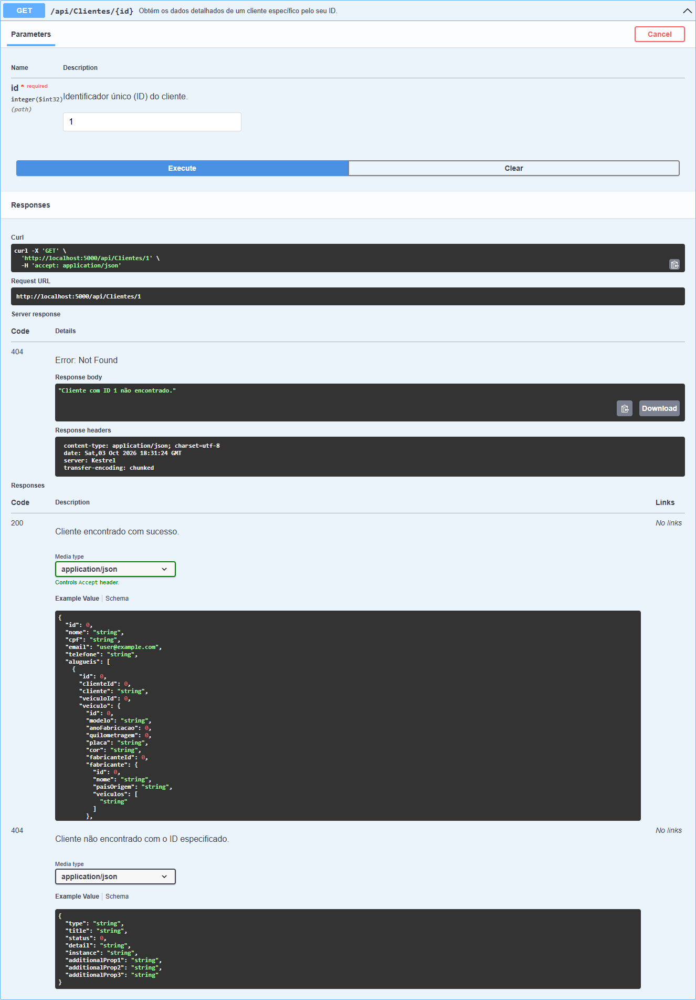

#### Teste TC-28: Atualização de Cliente
- **Método**: `PUT` `/api/Clientes/1`
- **Retorno**: `204 No Content`
- **Evidência Visual**:
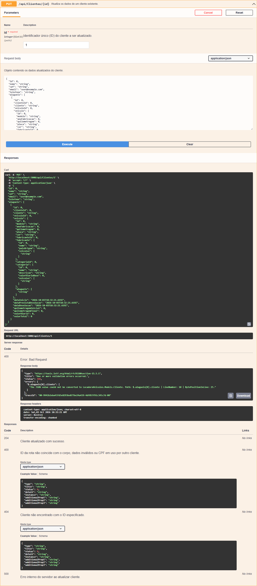

---

### 2.5. Módulo de Veículos

#### Teste TC-15: Cadastro de Veículo (Corolla Cross)
- **Método**: `POST` `/api/Veiculos`
- **Request Body**:
```json
{
  "modelo": "Corolla Cross XRE 2.0",
  "anoFabricacao": 2024,
  "quilometragem": 15000,
  "placa": "BRA2E19",
  "cor": "Prata",
  "fabricanteId": 1,
  "categoriaId": 1
}
```
- **Retorno**: `201 Created`
- **Evidência Visual**:


#### Teste TC-16: Cadastro de Veículo (Jetta GLI)
- **Método**: `POST` `/api/Veiculos`
- **Retorno**: `201 Created`
- **Evidência Visual**:
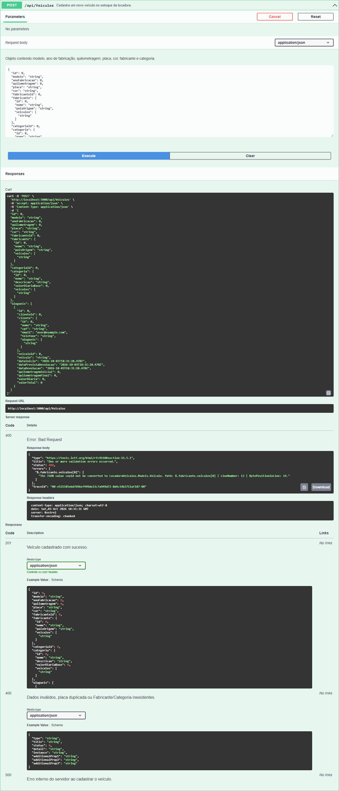

#### Teste TC-17: Consulta de Veículos Cadastrados
- **Método**: `GET` `/api/Veiculos`
- **Retorno**: `200 OK` (incluindo objetos aninhados de Fabricante e Categoria)
- **Evidência Visual**:
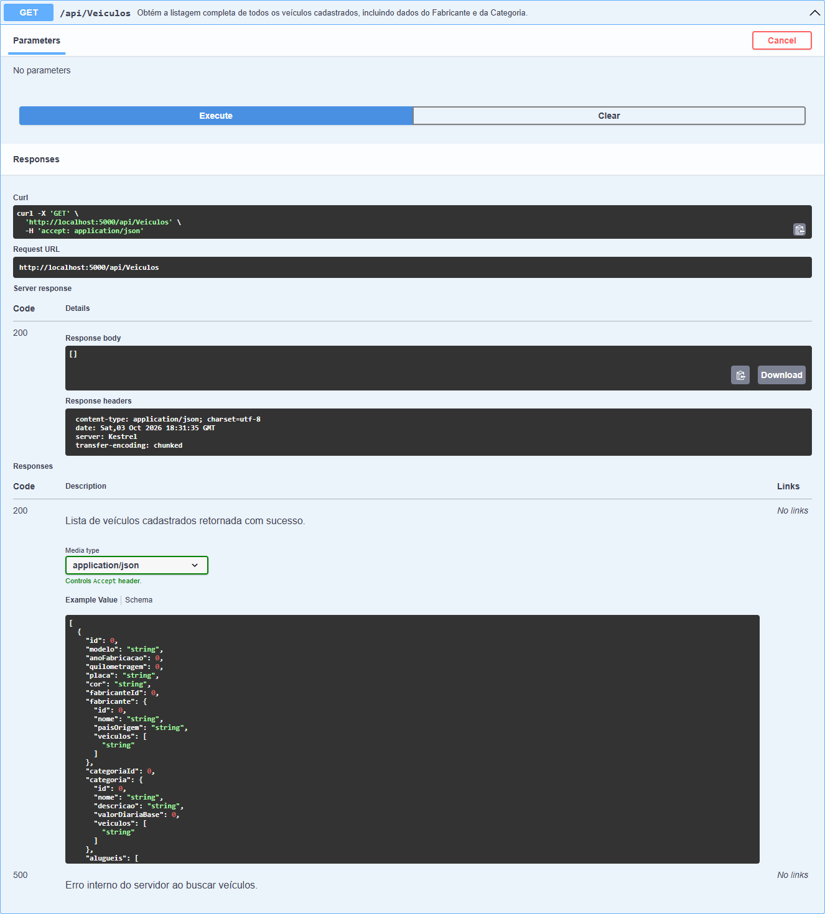

#### Teste TC-18: Consulta de Veículo por ID
- **Método**: `GET` `/api/Veiculos/1`
- **Retorno**: `200 OK`
- **Evidência Visual**:
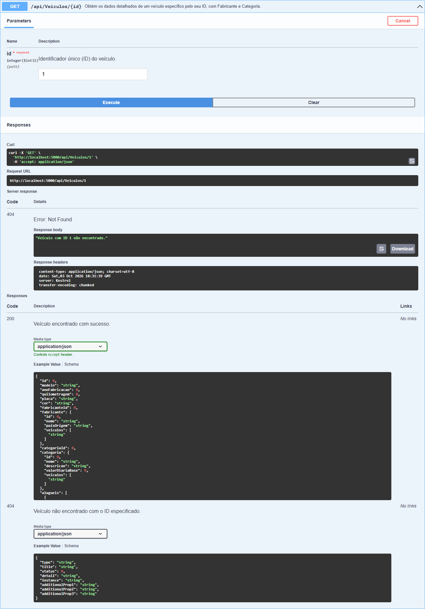

---

### 2.6. Módulo de Aluguéis e Operação de Devolução

#### Teste TC-19: Registro de Contrato de Aluguel
- **Método**: `POST` `/api/Alugueis`
- **Request Body**:
```json
{
  "dataInicio": "2026-10-01T08:00:00.000Z",
  "dataPrevistaDevolucao": "2026-10-06T08:00:00.000Z",
  "dataDevolucao": null,
  "valorDiaria": 180,
  "valorTotal": null,
  "quilometragemInicial": 15000,
  "quilometragemFinal": null,
  "clienteId": 1,
  "veiculoId": 1
}
```
- **Retorno**: `201 Created`
- **Evidência Visual**:


#### Teste TC-20: Consulta de Todos os Aluguéis
- **Método**: `GET` `/api/Alugueis`
- **Retorno**: `200 OK`
- **Evidência Visual**:


#### Teste TC-21: Devolução com Cálculo Automático e Atualização de KM
- **Método**: `PUT` `/api/Alugueis/1/devolucao?dataDevolucao=2026-10-06T10:00:00&quilometragemFinal=15450`
- **Resultado Obtido**:
  - Total de dias calculado: 5 dias
  - Valor total calculado: R$ 900,00 (`5 * 180.00`)
  - Quilometragem do veículo sincronizada no estoque: 15.450 km
- **Retorno**: `200 OK`
- **Evidência Visual**:
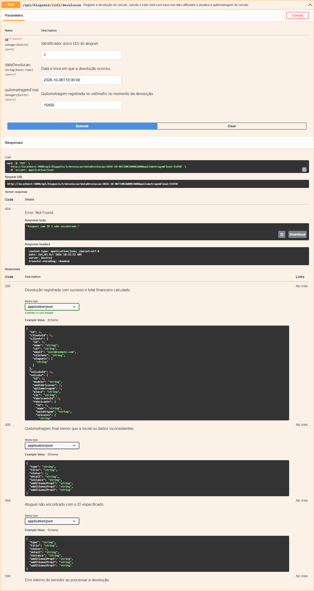

---

### 2.7. Módulo de Consultas Avançadas (LINQ JOINs e Agregações)

#### Teste TC-22: Filtro 1 (INNER JOIN) - Veículos Detalhados
- **Método**: `GET` `/api/Consultas/veiculos-detalhados?fabricante=Toyota`
- **Retorno**: `200 OK` (Combinação de dados do Veículo com Fabricante e Categoria)
- **Evidência Visual**:
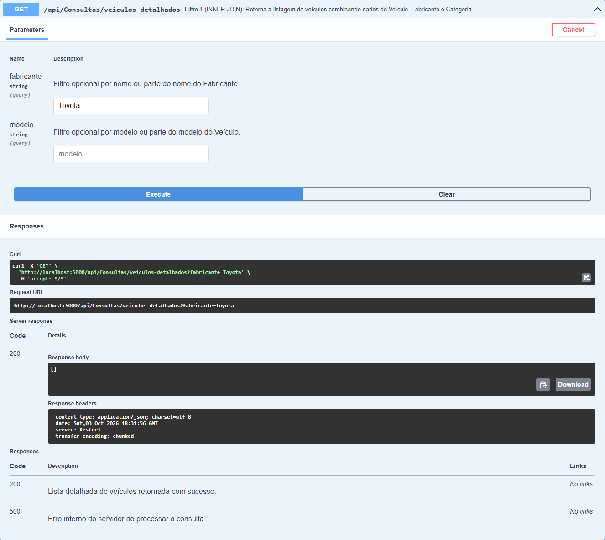

#### Teste TC-23: Filtro 2 (INNER JOIN) - Aluguéis por Cliente
- **Método**: `GET` `/api/Consultas/alugueis-por-cliente?cpf=123`
- **Retorno**: `200 OK` (Dados do cliente com placa e modelo do carro locado)
- **Evidência Visual**:


#### Teste TC-24: Filtro 3 (INNER JOIN + Agrupamento) - Total Gasto por Cliente
- **Método**: `GET` `/api/Consultas/total-gasto-por-cliente?valorMinimo=0`
- **Retorno**: `200 OK` (Total acumulado e quantidade de aluguéis por cliente)
- **Evidência Visual**:
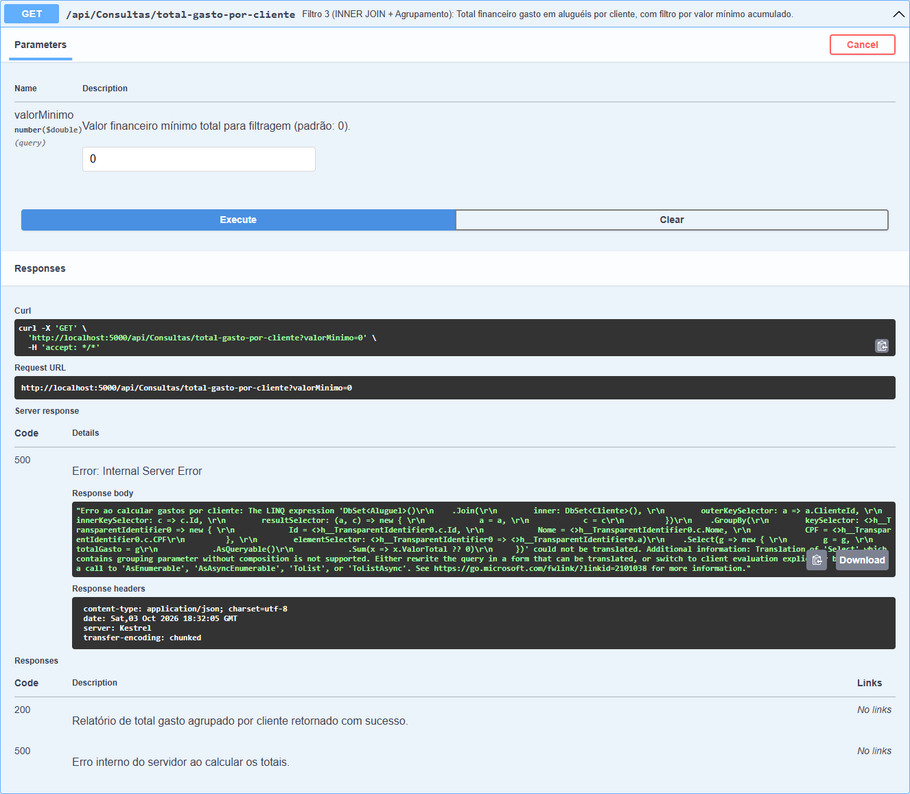

#### Teste TC-25: Filtro 4 (LEFT JOIN) - Clientes com ou sem Aluguel
- **Método**: `GET` `/api/Consultas/clientes-com-ou-sem-aluguel?apenasSemAluguel=false`
- **Retorno**: `200 OK` (Lista clientes ativos e clientes sem histórico de locação)
- **Evidência Visual**:
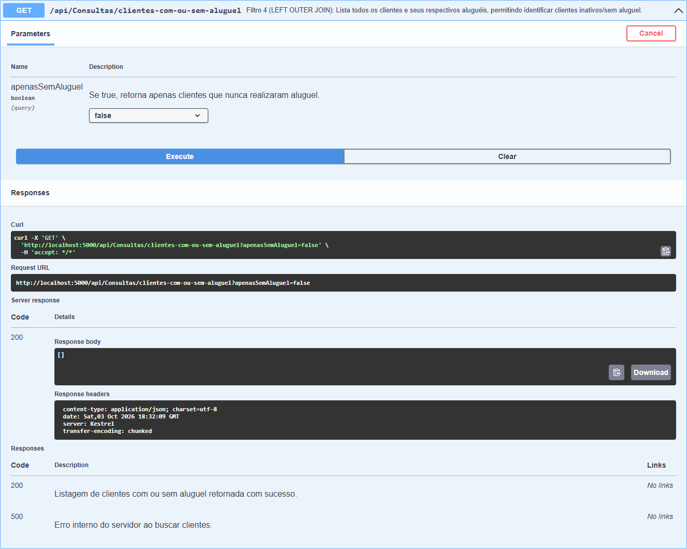

#### Teste TC-26: Filtro 5 (LEFT JOIN) - Disponibilidade da Frota
- **Método**: `GET` `/api/Consultas/veiculos-disponibilidade?apenasDisponiveis=true`
- **Retorno**: `200 OK` (Status em tempo real de veículos livres para locação)
- **Evidência Visual**:


---

## 3. Conclusão

Todas as 28 operações planejadas foram executadas diretamente através do **Swagger UI**, evidenciando:
1. Plena conformidade das respostas HTTP com o padrão RESTful (200, 201, 204, 400).
2. Validação efetiva de regras de integridade de dados (CPF único, consistência de quilometragem e integridade referencial).
3. Execução correta de consultas complexas em LINQ envolvendo INNER JOIN, LEFT JOIN e agregações matemáticas no SQL Server.
